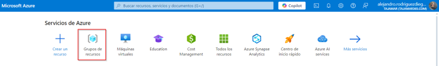
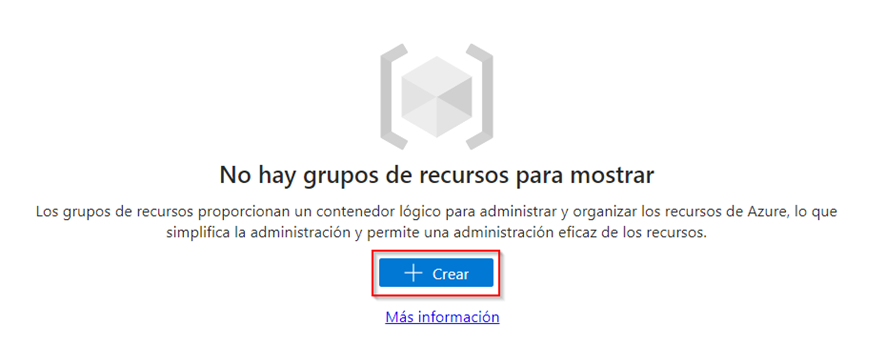
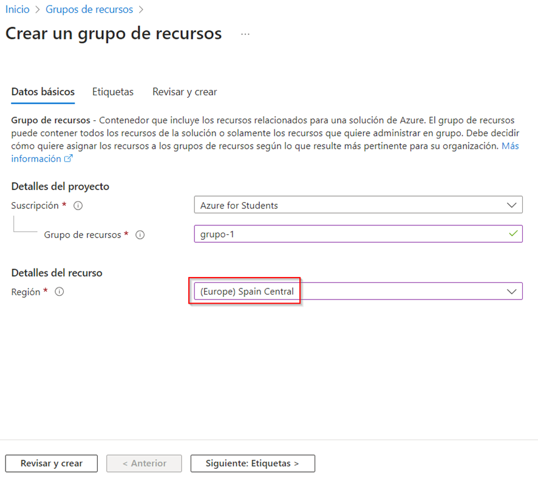
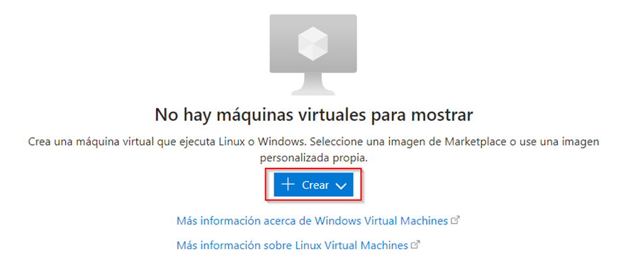
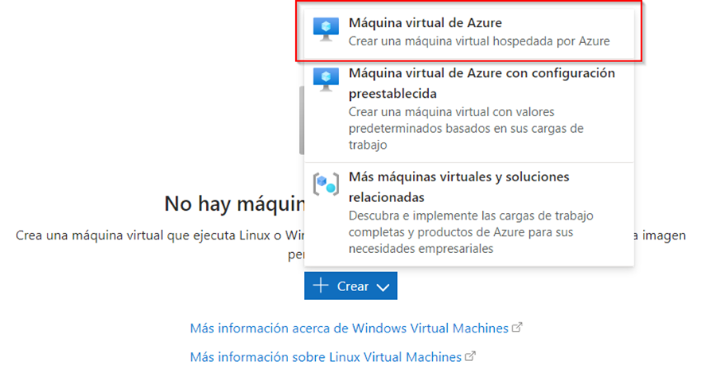
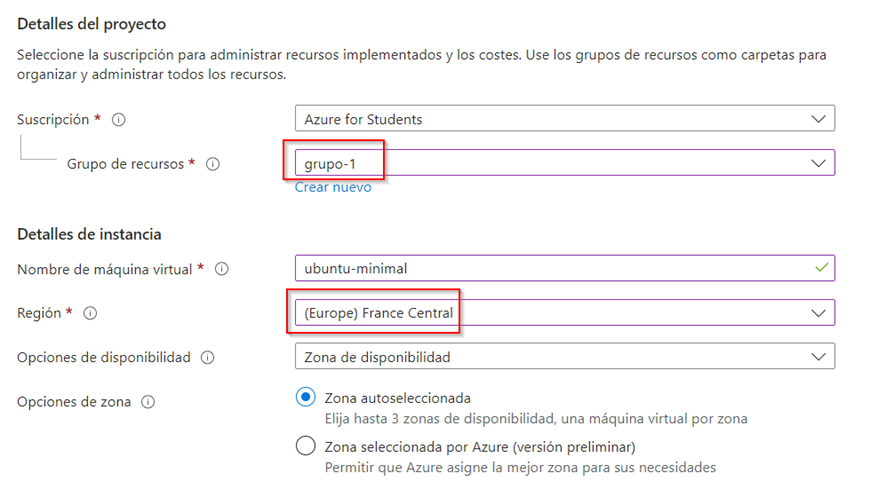
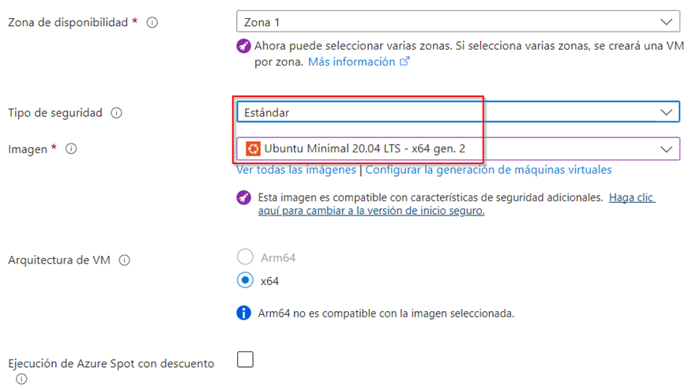
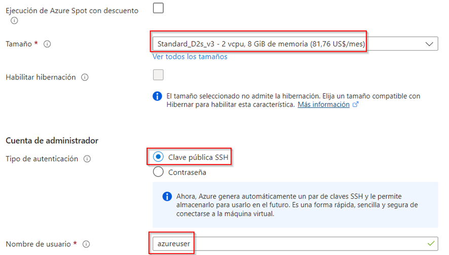
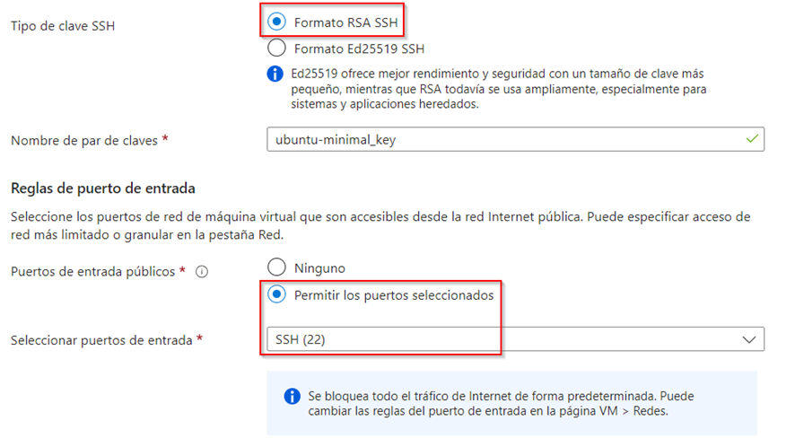
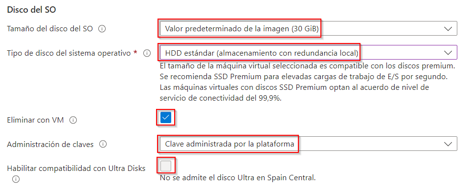

# Cluster Hadoop con Docker y Azure

Esta guía trata la configuración de un cluster de Hadoop en Docker y ejecución de un trabajo MapReduce, utilizando para ello una máquina virtual (MV) en Azure.

# Pasos de configuración

## 1️⃣ Crear una MV en Azure

Desde la página de inicio de Azure, crear un grupo de recursos en la región _Spain Central_:

---

Desde la página de inicio de Azure, crear una MV:

---

Asignamos la MV al grupo de recursos que creamos anteriormente, y seleccionamos la región _France Central_, puesto que _Spain Central_ da problemas con la configuración de esta MV:

---

### Configuración de la MV

- **Tipo de seguridad**: Estándar
- **Imagen**: Ubuntu Minimal 20.04 LTS - x64 gen. 2
- **Tamaño**: Standard_D2s_v3 - 2 vcpu, 8 GiB de memoria (81.76 US$/mes)
- **Tipo de autenticación**: Clave pública SSH
- **Nombre de usuario**: azureuser
- **Tipo de clave SSH**: Formato RSA SSH
- **Puertos de entrada públicos**: Permitir los puertos seleccionados
- **Seleccionar puertos de entrada**: SSH (22)

    
    
    

### Discos

- **Tamaño del disco del SO**: Valor predeterminado de la imagen (30GiB)
- **Tipo de disco del sistema operativo**: HDD estándar (almacenamiento con redundancia local)
- **Eliminar con VM**: *Seleccionado*
- **Administración de claves**: Clave administrada por la plataforma
- **Habilitar compatibilidad con Ultra Disks**: *No seleccionado*

    

### Redes
