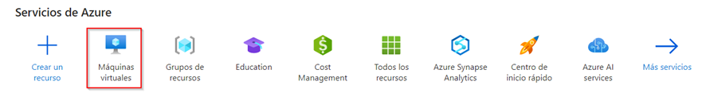

# Cluster Hadoop con Docker y Azure

Esta guía trata la configuración de un cluster de Hadoop en Docker y ejecución de un trabajo MapReduce, utilizando para ello una máquina virtual (MV) en Azure.

# Pasos de configuración y ejecución

## 1️⃣ Crear una MV en Azure

Desde la página de inicio de Azure, **crear un grupo de recursos** en la región _Spain Central_:


Desde la página de inicio de Azure, **crear una MV**:


**Asignar la MV al grupo de recursos** que fue creado anteriormente, y seleccionar la región _France Central_, puesto que _Spain Central_ da problemas con la configuración de esta MV:


## Configuración de la MV

- **Tipo de seguridad**: Estándar
- **images/imagen**: Ubuntu Minimal 20.04 LTS - x64 gen. 2
- **Tamaño**: Standard_D2s_v3 - 2 vcpu, 8 GiB de memoria (81.76 US$/mes)
- **Tipo de autenticación**: Clave pública SSH
- **Nombre de usuario**: azureuser
- **Tipo de clave SSH**: Formato RSA SSH
- **Puertos de entrada públicos**: Permitir los puertos seleccionados
- **Seleccionar puertos de entrada**: SSH (22)

    
    
    

### Discos

- **Tamaño del disco del SO**: Valor predeterminado de la images/imagen (30GiB)
- **Tipo de disco del sistema operativo**: HDD estándar (almacenamiento con redundancia local)
- **Eliminar con VM**: *Seleccionado*
- **Administración de claves**: Clave administrada por la plataforma
- **Habilitar compatibilidad con Ultra Disks**: *No seleccionado*

    

### Redes

- **Subred**: *Por defecto* (default)
- **IP Pública**: *Por defecto*
- **Grupo de seguridad de red de NIC**: Básico
- **Puertos de entrada públicos**: Permitir los puertos seleccionados
- **Seleccionar puertos de entrada**: SSH (22)
- **Eliminar IP pública y NIC cuando se elimine la VM**: *Seleccionado*
- **Habilitar redes aceleradas**: *No seleccionado*

    
    
    

### Administración

- **Identidad**: *No seleccionado*
- **Microsoft Entra ID**: *No seleccionado*
- **Habilitar apagado automático**: *Seleccionado*
- **Habilitar copia de seguridad**: *No seleccionado*
- **Opciones de orquestación de revisiones**: Valor predeterminado de la images/imagen

    
    

### Supervisión

- _Dejar todo como está **por defecto**, revisar que coincida con la images/imagen siguiente_:

    

### Opciones avanzadas

- _Dejar todo como está **por defecto**, revisar que coincida con las imágenes siguientes_:

    
    
    
    

## Revisar y crear

Descargar la clave privada y crear el recurso


## 2️⃣ Conectarse a la MV desde local

Navegar hasta la ruta donde se haya descargado la clave, y abrir dicha ruta en una terminal:


El comando utilizado para conectarse a la MV es el siguiente:

```powershell
ssh –i <ruta_de_la_clave> azureuser@<ip_de_la_vm>
```

Para **conocer la dirección IP** de la MV:


Al tratarse de una clave privada, es necesario que solo el usuario propietario tenga permisos sobre ella; de lo contrario, no se podrá acceder a la MV.

Para **configurar los permisos**:

```powershell
wsl
```

Se debe hacer `cd` de nuevo a la ruta de la clave, puesto que, de lo contrario, podría haber problemas entre el sistema de archivos de Windows y de WSL, y los permisos podrían no ser configurados correctamente.

> Nota: Antes de un espacio en una ruta en Linux, poner “\”.

```bash
cd <ruta/de/la/clave>
```

```bash
cd <Ruta/de/la/clave\ con/espacios>
```

**Cambiar permisos de la clave**:

```bash
chmod 600 <nombre_de_la_clave.pem>
```

**Salir de WSL**:

```bash
exit
```

**Ejecutar el comando en PowerShell**:

```powershell
ssh -i .\<nombre_de_la_clave.pem> azureuser@<ip_de_la_vm>
```

Aparecerá un mensaje similar al siguiente y se conectará la máquina local con la MV:


## 3️⃣ Configurar las reglas de seguridad en Azure




Para la Web UI de Hadoop:


Para el YARN ResourceManager:


Para guardar cada regla, hacer click en _Agregar_.

## 4️⃣ Instalar Docker y Docker Compose en la MV

1 - **Actualizar el sistema**

```bash
sudo apt update
sudo apt upgrade -y
```

2 - **Instalar dependencias**

Instala los paquetes necesarios para que Docker funcione correctamente:

```bash
sudo apt install -y apt-transport-https ca-certificates curl software-properties-common
```

3 - **Agregar el repositorio oficial de Docker**

Agrega la clave GPG oficial de Docker y luego el repositorio de Docker a APT:

```bash
curl -fsSL https://download.docker.com/linux/ubuntu/gpg | sudo gpg --dearmor -o /usr/share/keyrings/docker-archive-keyring.gpg
echo "deb [arch=$(dpkg --print-architecture) signed-by=/usr/share/keyrings/docker-archive-keyring.gpg] https://download.docker.com/linux/ubuntu $(lsb_release -cs) stable" | sudo tee /etc/apt/sources.list.d/docker.list > /dev/null
```

4 - **Instalar Docker**

Actualiza los repositorios y luego instala Docker:

```bash
sudo apt update
sudo apt install -y docker-ce docker-ce-cli containerd.io
```

5 - **Verificar la instalación de Docker**

```bash
sudo docker --version
```

6 - **Habilitar Docker para que se inicie automáticamente al arrancar**

```bash
sudo systemctl enable docker
sudo systemctl start docker
```

7 - **(Opcional)** Agregar el usuario al grupo _docker_

Si se desea ejecutar Docker sin usar `sudo`, agrega el usuario al grupo _docker_:

```bash
sudo usermod -aG docker ${USER}
```

> Nota: Para que los cambios surtan efecto, hay que cerrar la sesión y volver a abrirla.

8 - **Instalar Docker Compose**

Descarga la versión más reciente de Docker Compose:

```bash
sudo curl -L "https://github.com/docker/compose/releases/download/v2.30.1/docker-compose-$(uname -s)-$(uname -m)" -o /usr/local/bin/docker-compose
```

Configura los permisos de ejecución al archivo descargado:

```bash
sudo chmod +x /usr/local/bin/docker-compose
```

9 - **Verificar la instalación de Docker Compose**

```bash
docker-compose --version
```

10 - **(Opcional)** Configurar la autocompletación de Docker Compose

Para facilitar el uso de Docker Compose, se puede habilitar la autocompletación de comandos:

```bash
sudo curl -L https://raw.githubusercontent.com/docker/compose/1.29.2/contrib/completion/bash/docker-compose -o /etc/bash_completion.d/docker-compose
```
